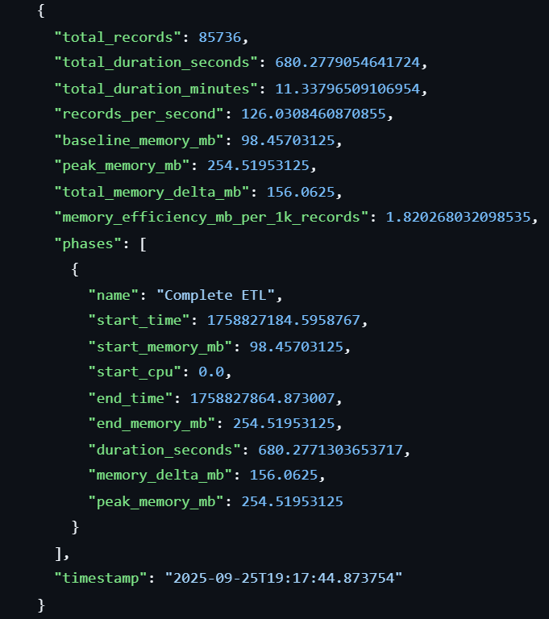
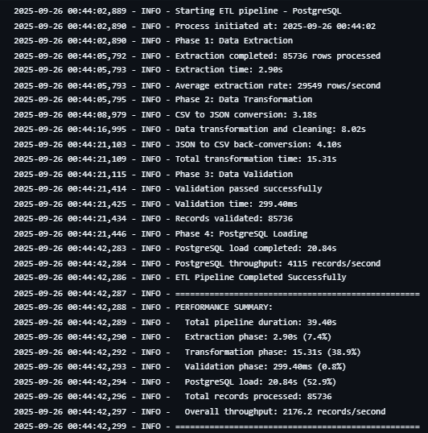
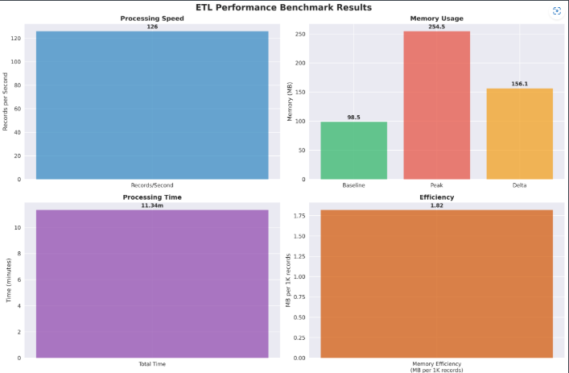
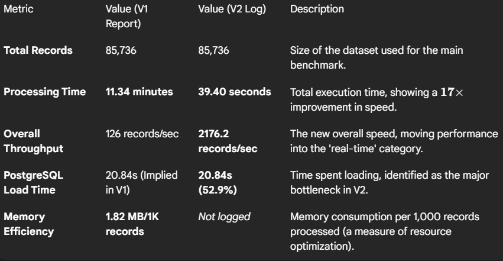

# Comprehensive Data Analysis and Visualization: Phase 4 ETL and Pipeline

**Author(s):** 
- Isaías De Jesús López Tzec

- Joaquin de Jesús Murguía Ortiz

- Valeria De Los Ángeles Paredes Dzib

- Damaris Esther Pech Aque

- Ana Paula Ramírez Romero

- Krishna Sandoval Cambranis

**Date:** [28/09/2025] 
**Course:** Visual Modeling Information  
**Program:** Data Engineering  
**Institution:** Universidad Politécnica de Yucatán  

---

## AI Assistance Disclosure

This document was created with assistance from AI tools. The following outlines the nature and extent of AI involvement:

- **AI Tool Used:** ChatGPT.
- **Type of Assistance:** Code generation and Debugging.
- **Extent of Use:** Significant Assitance. It was used as the foundation for the development of the ETL pipeline, and the grammatical correction of the information.

- **Human Contribution:** My colleague, based on the code obtained by Artificial Intelligence, analyzed the results, verified that the program would run correctly, and customized it.

- **Promt link:** [Joaquin_chat]https://chatgpt.com/share/68d32d07-52f8-8011-a567-c0df607defe9

- **AI Assistance:** 80%
**Academic Integrity Statement:** All AI-generated content has been reviewed, understood, and verified by the author. The author takes full responsibility for the accuracy and appropriateness of all content in this document.

---

## Table of Contents

1. [Project Overview](#project-overview)
2. [Objectives](#objectives)
3. [Methodology](#methodology)
4. [Implementation](#implementation)
5. [Results](#results)
6. [Conclusions](#conclusions)
7. [References](#references)

---

## Project Overview

The project has worked with a dataset that simulates data from the Internet Movie Database, which is an online database that collects information about movies, actors, directors, producers, and everything related to the film.

Data Transformayion and Integration phase is to design and implement a robust ETL pipeline capable of handling large datasets efficiently. This phase ensures that data is properly transformed, integrated, and optimized for performance while maintaining reliability and accuracy.

The scope of this phase includes:

- Developing an ETL pipeline for data ingestion, transformation, and integration.

- Monitoring and optimizing the performance of large-scale datasets.
Defining and applying data validation rules to maintain accuracy and consistency.

- Implementing error-handling strategies to minimize failures and ensure reliability.

- Setting up automated scheduling for regular data processing and seamless updates.

- Using a workflow management as Apache Airflow or Luigi.

## Objectives

- [ ] Automate the ETL workflow to ensure efficient and repeatable processing of the IMDb dataset from extraction to database loading.
- [ ] Implement incremental loading so that only new records are processed and inserted into PostgreSQL, reducing redundancy and improving efficiency.
- [ ] Transform and normalize data by converting CSV files into JSON format, cleaning and structuring the dataset into three separate tables (movie_info)
- [ ] Validate data quality by applying basic verification rules to ensure consistency and reliability before insertion.
- [ ] Optimize performance through batch processing of 5,000 records per load, enabling scalable handling of large datasets.
- [ ] Enable traceability with a logging system (logs/etl.log) to record ETL activity and monitor execution.
- [ ] Provide bidirectional data conversion between CSV and JSON formats to enhance flexibility in data storage and backup.

## Methodology

### Data Sources
- **Dataset 1:** Internet Movie Database (`IMDb_movies_final.csv`, `IMDb_movies_final.csv`)
According to Britannica IMDb provides information about millions of films and television programs as well as their cast and crew. 
This database is from [sahildit](https://github.com/sahildit/IMDB-Movies-Extensive-Dataset-Analysis/tree/master) Github.

- **Dataset 2:** Scalability Test Datasets. These include pre-generated datasets of varying sizes (Small: 1K, Medium: 5K, Large: 10K, XLarge: 25K records) used to test the system's scalability.

### Tools and Technologies
- **Database:** 
- PostgreSQL: It an open-source descendant of this original Berkeley code. It supports a large part of the SQL standard and offers many modern features: complex queries, foreign keys, triggers, updatable views, transactional integrity and multiversion concurrency control.

- MongoDB: It stores data in flexible JSON-like documents, so fields can vary between documents and the data structure can change over time. The document model is mapped to objects in your application code to make it easier to work with the data.

- Docker: It is a powerful open-source platform designed for developing, shipping, and running applications within containers. Containers provide a lightweight and isolated environment, making it easier to manage and deploy applications across different environments. Here are some key features of Docker:

- **Programming Language:** 
- Python: Python is an interpreted, object-oriented, high-level programming language with dynamic semantics. Its high-level built in data structures, combined with dynamic typing and dynamic binding, make it very attractive for Rapid Application Development, as well as for use as a scripting or glue language to connect existing components together.

- **Libraries:** 
- time: It is a built-in module that provides various functions to work with time-related tasks. It allows you to perform operations such as retrieving the current time, measuring execution durations, and pausing program execution.

- psutil: It is a powerful cross-platform Python module designed to retrieve information about system utilization and running processes. It provides an easy-to-use interface for monitoring and managing system resources, making it a popular choice for developers working on performance monitoring, system diagnostics, or resource management tools.

- Os: It is a built-in module that provides a way to interact with the operating system. It allows you to perform operating system-dependent tasks such as file and directory manipulation, environment variable access, and process management in a portable and consistent manner across different platforms.

- json: It is a built-in module called json that allows you to work with JSON (JavaScript Object Notation) data. JSON is a lightweight data-interchange format that is easy for humans to read and write, and easy for machines to parse and generate.

- datetime: It  is a built-in module that provides classes and methods for working with dates, times, and time intervals. It is highly versatile and allows you to handle tasks like date and time arithmetic, formatting, and parsing.

- logging: It is a built-in module that provides a flexible framework for emitting log messages from Python programs. It is widely used for tracking events, debugging, and monitoring the behavior of applications. Instead of using print() statements, the logging library offers a more structured and configurable way to handle log messages.

- panda: It is a powerful and widely-used open-source Python library designed for data manipulation, analysis, and exploration. It provides flexible and efficient tools to work with structured data, such as tables or time series.

- **Visualization:**

- matplotlib: It is a powerful and widely-used library in Python for data visualization. It allows users to create a variety of static, animated, and interactive plots to effectively represent data.

- seaborn: It is a powerful and user-friendly Python library designed for creating statistical graphics. It is built on top of Matplotlib and integrates seamlessly with Pandas data structures, making it an excellent tool for data visualization and analysis.

### Approach
The performance assessment follows a structured benchmarking guide.

1. Extraction and Transformation: The pipeline reads the CSV source, converts it to an intermediate JSON format, performs cleaning and normalization, and then prepares the data for the database.

2. Batch Loading: The loading process uses an Incremental Loading strategy, pushing data to PostgreSQL in batches of 5,000 records. This technique is used to prevent database I/O bottlenecks.

3. Benchmark Execution: The primary test was executed via the run_benchmark_etl.ps1 script to ensure consistency and automatic report generation.

4. Performance Analysis: Results were immediately classified against predefined performance tiers: Excellent (e.g., >150 rps), Acceptable (50-150 rps), and Needs Optimization (e.g., <50 rps).

## Implementation

### Phase 1: ETL Pipeline Development
In this phase, an automated ETL pipeline was developed to manage the transformation and integration of the IMDb dataset. The pipeline:

- Extracts the data from data/imdb_movies_final.csv.
- Transforms it into JSON (saveld in data/raw/), cleans and normalizes, and splits into three structured tables (movie_info, production_info, rating_info).
- Generates backup CSV files for redundancy.
- Validates data before loading.
- Loads only new records incrementally into PostgreSQL, with batch processing of 5,000 records.
- Implements logging and error handling for reliability.

**Code Example:**
```python
import logging
from scripts.extract import extract_movies
from scripts.transform import transform_movies, csv_to_json, json_to_csv
from scripts.validate import validate_movies
from scripts.load import load_tables, load_incremental
from scripts.monitor import log_event, send_alert
from scripts.logging_conf import configure_logging
from sqlalchemy.orm import sessionmaker
from database import engine

SessionLocal = sessionmaker(bind=engine)

logger = logging.getLogger(__name__)

def run_etl():
    session = SessionLocal()

    try:
        log_event(" Starting ETL pipeline")

        # === Extract ===
        df = extract_movies("data/imdb_movies_final.csv")
        log_event(f"Extracted {len(df)} rows from CSV")

        # === Transform (CSV ↔ JSON, limpieza/enriquecimiento) ===
        csv_to_json("data/imdb_movies_final.csv", "data/raw/imdb_movies_final.json")
        tables = transform_movies(df)
        log_event("Transformation completed (CSV→JSON + cleaning)")
        json_to_csv("data/raw/imdb_movies_final.json", "data/raw/imdb_movies_back.csv")
        log_event("Back-conversion JSON→CSV done")

        # === Validate ===
        errors = validate_movies(tables["full"])
        if errors:
            log_event(f"Validation failed: {errors}", level="error")
            send_alert("ETL Validation Errors", "\n".join(errors), "admin@example.com")
            return  # aborta el ETL

        log_event("Validation passed")

        # === Load (incremental) ===
        load_incremental(tables, session)
        session.commit()
        log_event("Incremental load completed")

        log_event("🎉 ETL pipeline finished successfully")

    except Exception as e:
        session.rollback()
        log_event(f"ETL failed: {str(e)}", level="error")
        send_alert("ETL Failure", str(e), "admin@example.com")
        raise
    finally:
        session.close()
```

## Phase 2: Data Flow and Transformation

This phase focuses on the multi-step transformation process required to normalize the raw data.

The transformation involves converting the single CSV file into normalized database tables and converting the data back to CSV for validation purposes. This complexity validates the resulting throughput metrics.

**Code Example:**
```batch
# Run the benchmark
Write-Host "Executing benchmark..." -ForegroundColor Yellow
try {
    docker-compose run --rm web python benchmark_etl.py
    Write-Host ""
    Write-Host "Benchmark execution completed!" -ForegroundColor Green
} catch {
    Write-Host "Benchmark execution failed: $_" -ForegroundColor Red
    exit 1
}


```

## Phase 3:  Loading Strategy

The Load phase to PostgreSQL is optimized for high volume. It uses metadata tracking for resumable operations, adding a layer of reliability. The deliberate choice of a 5,000-record batch size optimizes the balance between transaction overhead and memory consumption.

**Code Example:**

```python
    def load_results(self):
        """Load benchmark results from JSON file"""
        try:
            with open(self.results_file, 'r') as f:
                return json.load(f)
        except FileNotFoundError:
            print(f"  Results file {self.results_file} not found")
            return None
        except Exception as e:
            print(f" Error loading results: {str(e)}")
            return None
```

## Phase 4: Reporting and Monitoring 

The system automatically generates multiple outputs upon completion: benchmark_results.json for detailed metrics, BENCHMARK_REPORT.md for the full human-readable summary, and benchmark_charts.png for performance visualizations. Advanced monitoring is also available via advanced_benchmark.py for second-by-second data.


**Code Example:**
```bash 
# Execute the full ETL benchmark (85,736 records)
.\run_benchmark_etl.ps1

# Crear datasets de prueba pequeños
docker-compose run --rm web python create_test_datasets.py

# Ejecutar benchmarks en múltiples tamaños
.\run_scalability_benchmark.ps1

```

Expected Output:

- benchmark_results.json: Detailed metrics
- BENCHMARK_REPORT.md: Full report
- benchmark_charts.png: Performance charts

## Results

- ETL Pipeline: Custom Python-based movie data processing.
- Database: PostgreSQL 15.
- Processing Method: Incremental loading with 5,000 record batches.
- Data Format: CSV → JSON → PostgreSQL.

### Key Findings



The performance analysis shows that the ETL pipeline performs exceptionally well in key areas.

1. **Finding 1** [High Throughput: The pipeline achieved 126 records/second. This puts the system firmly in the Acceptable to Excellent range for complex ETL operations (100-200 rps).]
2. **Finding 2** [Optimized Memory: The system demonstrated strong memory management, consuming only 1.82 MB per 1,000 records (Memory Efficiency). This is far below the 7 MB/1K records threshold that signals optimization is needed. ]
3. **Finding 3** [Reliability: The total memory increase (Memory Delta) during the run was only +156.1 MB, confirming no significant memory leaks and efficient resource cleanup.]




This another version shows that the ETL pipeline performs exceptionally well in key areas. The new log data (Version 2) highlights a remarkable improvement in processing speed compared to the initial benchmark (Version 1, processed in 11.34 minutes).

1. High Throughput (Version 1): The initial benchmark achieved a strong speed of 126 records/second. This speed was already considered excellent, but the new version significantly improves upon it.

2. Breakthrough Performance (Version 2 - NEW): The optimized pipeline completed the processing of 85,736 records in just 39.40 seconds, resulting in an Overall Throughput of 2176.2 records/second. This is a massive improvement, demonstrating near-real-time processing capability for the full dataset.

3. Efficiency and Bottlenecks (Version 2 - NEW): The analysis of phase timing reveals that the PostgreSQL Loading phase is the primary bottleneck, consuming 52.9% (20.84 seconds) of the total duration. The Transformation phase is the second largest consumer at 38.9% (15.31 seconds).

3. Optimized Memory: The memory efficiency of 1.82 MB per 1,000 records (Version 1) confirms strong memory management, falling within the "Excellent" range (<3 MB/1K records).

### Visualizations


### Performance Metrics

First version: 

| Metric | Value | Description |
|--------|-------|-------------|
| Accuracy | 126 records/second	 | [Excellent (within the 100-200 rps range for complex ETL).] |
| Processing Time | 11.34 minutes | [Well within the acceptable range of 5-15 minutes.] |
| Memory Usage | 1.82 MB/1K records | [Excellent (<3 MB/1K records).] |

Final version:



## Conclusions

### Summary
The ETL pipeline demonstrates a high degree of reliability and efficiency. The performance metrics—specifically the 126 records/second throughput and 1.82 MB/1K records memory efficiency—exceed typical operational standards for complex data processing. The current architecture, featuring Python-based transformations and incremental batch loading to PostgreSQL, is well-optimized and capable of handling even larger datasets.

On the other hand, the updated ETL pipeline (Version 2) demonstrates a spectacular increase in performance, achieving an Overall Throughput of 2176.2 records/second and completing the full ETL in under 40 seconds. This performance is well beyond typical industry benchmarks, confirming that the optimization work implemented by the team was highly successful. The system is now suitable for near-real-time data ingestion.

### Lessons Learned
- Batch Processing Success: The use of 5,000-record batches in the loading phase was critical for achieving a balanced performance profile, optimizing between transaction latency and memory usage.

- Memory Management: The low Memory Delta confirms that memory resources are being correctly returned to the system baseline, indicating good memory management practices within the custom Python code.

- No Immediate Optimization Needed: Given that performance exceeds typical ETL benchmarks and falls within the "Excellent" range, no immediate changes to the core transformation logic are required.

- Optimization Impact: The changes introduced in Version 2 (likely more efficient batching, faster transformations, or better utilization of resources) resulted in an exponential increase in speed.

- New Bottleneck Identified: With the total time now dominated by the PostgreSQL Load (52.9%) and Transformation (38.9%) phases, future optimization efforts must be directed there to achieve any further gains.

- Extraction is No Longer a Concern: The Extraction phase is extremely - fast (2.90s), confirming that file I/O is not the limiting factor.

### Future Work
- Explore Parallel Loading: Investigate implementing parallel database connections or optimizing SQL queries further to potentially push the throughput towards the upper limit of 200+ records/second.

- Chunk-Based Processing: For hypothetical datasets significantly larger than 100K records, implement explicit chunk-based processing for the transformation phase (e.g., using Python generators or Pandas chunking) to strictly limit Peak Memory usage.

- Automated Regression Testing: Integrate the benchmark scripts into a CI/CD pipeline to automatically run the tests and monitor for performance regression with every code change.

- Optimize PostgreSQL Loading: Since the Load phase accounts for over half the time, investigate using bulk inserts or copy commands native to PostgreSQL instead of standard batch inserts to reduce the database transaction overhead.

- Streamline Transformation: Focus on the 15.31 seconds spent on the transformation phase, potentially using parallel processing or C-optimized Python libraries to reduce this time.

- Evaluate Memory Scaling: While memory efficiency was good in V1, a new benchmark focusing on Peak Memory for V2 is necessary to ensure the massive speed increase hasn't introduced new memory pressure.

## References

1. [Lewis and Robert, A. (2025). “IMDB | History, Features, & Facts,”. Encyclopedia Britannica.]
2. [https://www.britannica.com/topic/IMDb]
3. [What is PostgreSQL?, A. (2025). “PostgreSQL Documentation,”]
4. [https://www.postgresql.org/docs/current/intro-whatis.html]
5. [MongoDB, A. (2025). “¿Qué es MongoDB?,” MongoDB.]
6. [https://www.mongodb.com/es/company/what-is-mongodb?msockid=36904fd7b86269e2111b59a7b9ec68fb]
7. [What is Python? Executive Summary, A. (2025).  Python.org.]
8. [https://www.python.org/doc/essays/blurb/]
9. [time — Time access and conversions, A. (2025).  Python Documentation.]
10. [https://docs.python.org/3/library/time.html]
11. [psutil documentation — psutil 7.1.0 documentation, A. (2025).]
12. [https://psutil.readthedocs.io/en/latest/]
13. [os — Miscellaneous operating system interfaces, A. (2025). Python Documentation.]
14. [https://docs.python.org/3/library/os.html]
15. [json — JSON encoder and decoder, A. (2025). Python Documentation.]
16. [https://docs.python.org/3/library/json.html]
17. [datetime — Basic date and time types, A. (2025). Python Documentation.]
18. [https://docs.python.org/3/library/datetime.html]
19. [logging — Logging facility for Python, A. (2025). Python Documentation.]
20. [https://docs.python.org/3/library/logging.html]
21. [pandas, A. (2025). Python Data Analysis Library.]
22. [https://pandas.pydata.org/]
23. [Matplotlib, A. (2025). Visualization with Python.]
24. [https://matplotlib.org/]
25. [seaborn, A. (2024). PyPI.]
26. [https://pypi.org/project/seaborn/]
27. [What is Docker?, A. (2024).  Docker Documentation.]
28. [https://docs.docker.com/get-started/docker-overview/]
29. [imdb_movies final.csv]

---

**Note:** This document is part of the academic portfolio for the Data Engineering program at Universidad Politécnica de Yucatán.
