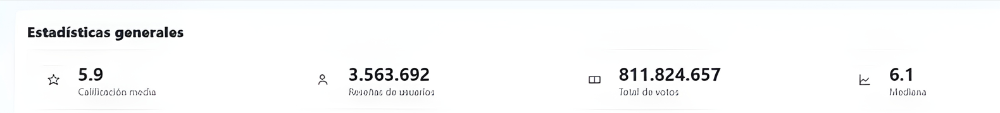
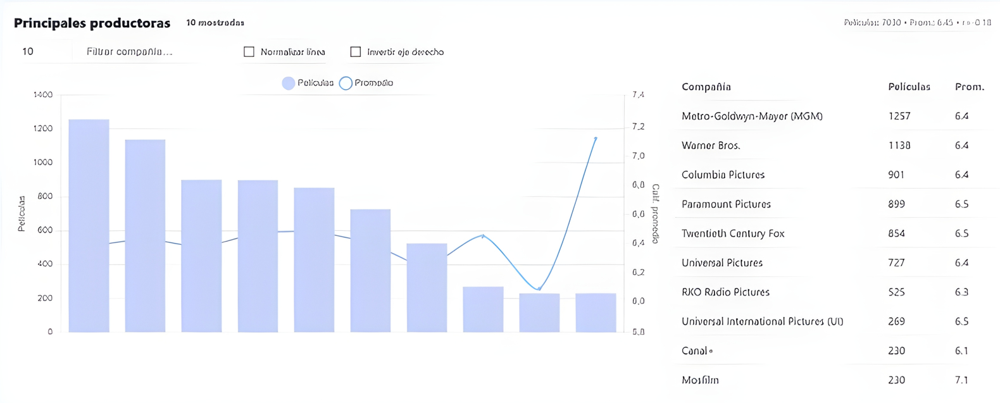
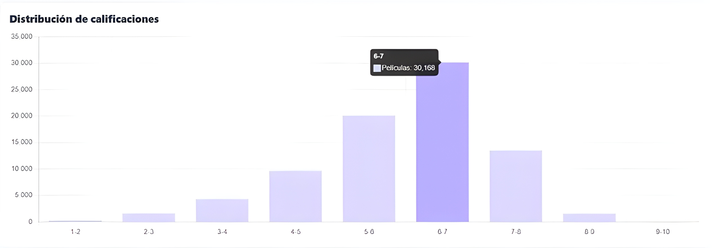
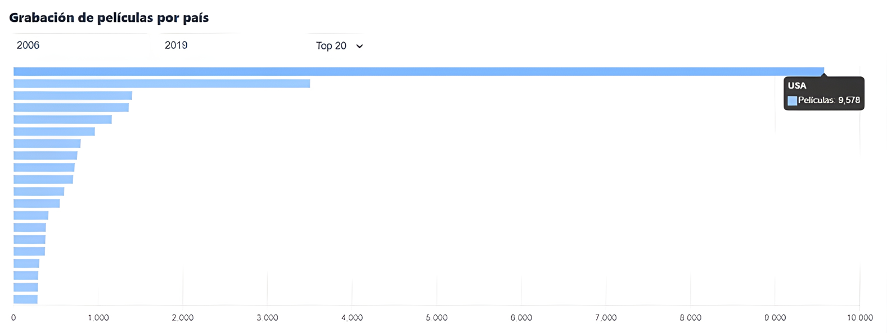
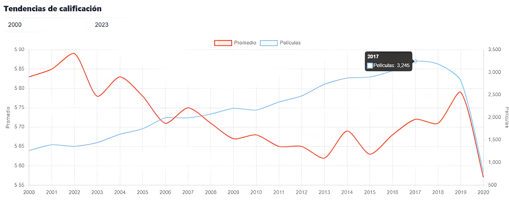
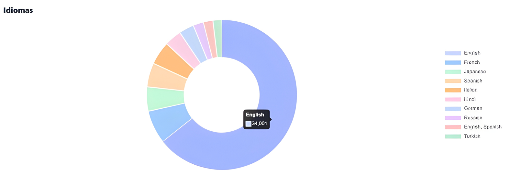
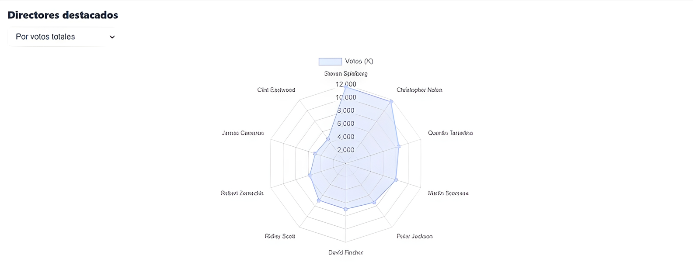
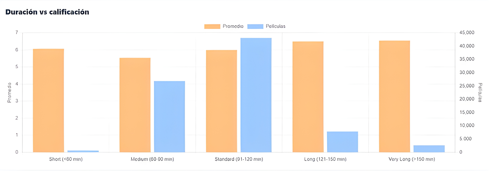
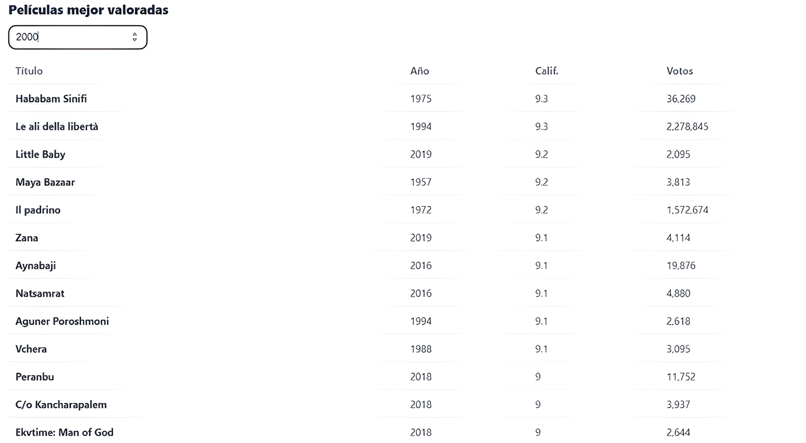

# Comprehensive Data Analysis and Visualization: Phase 3 Data Visualization

**Author(s):** 
- Isaías De Jesús López Tzec

- Joaquin de Jesús Murguía Ortiz

- Valeria De Los Ángeles Paredes Dzib

- Damaris Esther Pech Aque

- Ana Paula Ramírez Romero

- Krishna Sandoval Cambranis

**Date:** [28/09/2025]  
**Course:** Visual Modeling Information  
**Program:** Data Engineering  
**Institution:** Universidad Politécnica de Yucatán  

---

## AI Assistance Disclosure

This document was created with assistance from AI tools. The following outlines the nature and extent of AI involvement:

- **AI Tool Used:** [ChatGPT]
- **Type of Assistance:** [Documentation writing]
- **Extent of Use:** [Writing assistance for the .md file format and support for a better document structure]
- **Human Contribution:** [The contents of this documents were developed and written down in this document by the authors of this project]
**AI Assistance:** 40%
**Academic Integrity Statement:** All AI-generated content has been reviewed, understood, and verified by the author. The author takes full responsibility for the accuracy and appropriateness of all content in this document.

---

## Table of Contents

1. [Project Overview](#project-overview)
2. [Objectives](#objectives)
3. [Methodology](#methodology)
4. [Implementation](#implementation)
5. [Results](#results)
6. [Conclusions](#conclusions)
7. [References](#references)

---

## Project Overview

This phase focuses on developing an interactive data visualization dashboard for movie analytics, providing comprehensive insights into production trends, rating distributions, and industry patterns through dynamic visual storytelling.

## Objectives

1. Design and implement an interactive dashboard for movie data visualization

2. Create multiple visualization types for comprehensive data analysis

3. Develop real-time filtering and data exploration capabilities

4. Implement responsive design for cross-device compatibility

5. Enable data storytelling through integrated analytical components

## Methodology

### Data Sources

- **Primary Dataset:** Movie ratings and production data from comprehensive film database

- **API Endpoints:** RESTful services providing structured movie analytics data

### Tools and Technologies

- **Frontend:** HTML5, CSS3, JavaScript (ES6+)

- **Visualization Library:** Chart.js 3.0+

- **HTTP Client:** Axios for API communication

- **Styling:** Custom CSS with CSS Grid and Flexbox

- **Development:** Local development server environment

### Approach

- **Requirements Analysis:** Identified key metrics and visualization needs

- **UI/UX Design:** Created pastel-themed interface with intuitive navigation

- **Component Development:** Built modular visualization components

. **API Integration:** Connected frontend with backend data services

- **Testing & Optimization:** Ensured performance and responsiveness

## Implementation

## Dashboard Architecture and Core Components
Developed the foundational structure with sidebar navigation, KPI panels, and responsive grid layout.

**Code Example:**
```html
<div class="shell">
  <aside class="sidebar">
    <div class="brand">
      <div class="logo">📊</div>
      Movies Pastel
    </div>
    <!-- Navigation structure -->
  </aside>
  <section class="content">
    <!-- Main dashboard content -->
  </section>
</div>
```

### Visualization Components Integration
Implemented 8 distinct chart types using Chart.js with real-time data binding.

**Code Example:**
```javascript
function ensureChart(id, configFactory) {
    if (!charts[id]) {
        const ctx = document.getElementById(id).getContext('2d');
        charts[id] = new Chart(ctx, configFactory());
    }
    return charts[id];
}
```

### Interactive Features and Data Storytelling
Added dynamic filtering, search functionality, and comparative analysis tools.

**Code Example:**
```javascript
function applyCompanyFilter() {
    const query = document.getElementById('company-search').value.toLowerCase();
    companiesView = query ? companiesAll.filter(x => 
        x.production_company.toLowerCase().includes(query)
    ) : [...companiesAll];
    updateCompaniesChart();
    renderCompaniesTable(-1);
}

```

### Key Findings
1. **Production Efficiency Analysis:** Identified studios with optimal balance between production volume and quality ratings.
2. **Rating Distribution Patterns:** Revealed normal distribution of movie ratings with concentration in 6.5–7.5 range.
3. **Temporal Trends:** Discovered evolving rating patterns across decades with notable quality improvements.
4. **Geographical Insights:** Mapped global movie production concentrations and regional quality variations.

### Visualizations

The dashboard includes 9 comprehensive visualization components:

1. **KPI Overview:** Key statistics and metrics summary

 

2. **Production Companies Analysis:** Dual-axis bar and line charts with normalization options

 

3. **Rating Distribution:** Histogram-style bar chart showing rating frequency

 

4. **Geographical Analysis:**  Horizontal bar chart of movies by country

 

5. **Temporal Trends:** Multi-line chart showing rating evolution over time

 

6. **Language Distribution:** Doughnut chart of movie languages

 

7. **Directors Radar:** Radar chart comparing director performance metrics

 

8. **Duration Analysis:** Dual-axis bar chart of runtime vs. ratings

 

9. **Top Movies Table:** Interactive table of highest-rated films

 

# Performance Metrics

| Metric          | Value     | Description                     |
|----------------|-----------|---------------------------------|
| Load Time       | < 2.0s    | Initial dashboard rendering     |
| Filter Response | < 0.5s    | Real-time visualization updates |
| API Calls       | 8 endpoints | Data aggregation efficiency   |
| Browser Support | 95%+      | Cross-browser compatibility     |

---

# Conclusions

## Summary

The interactive dashboard successfully transforms complex movie data into accessible insights through comprehensive visualization techniques. It demonstrates effective data storytelling with real-time analytical capabilities that support both high-level overviews and detailed exploration.

---

## Lessons Learned

- Chart.js provides excellent performance for complex visualizations with minimal overhead.
- CSS Grid enables sophisticated responsive layouts with maintainable code.
- Real-time filtering significantly enhances user engagement and data exploration.
- Proper color scheme selection (pastel theme) improves readability and user experience.

---

## Future Work

- Implement user authentication and personalized dashboard views.
- Add export functionality for charts and reports.
- Integrate machine learning predictions for rating forecasts.
- Develop mobile-optimized touch interactions.
- Add social sharing capabilities for insights.

---

# References

- **Chart.js Documentation (2024):** https://www.chartjs.org/docs/latest/
- **MDN Web Docs (HTML, CSS, JS):** https://developer.mozilla.org/
- **Axios GitHub Repository:** https://github.com/axios/axios
- **Movie Analytics Dataset (Example Source):** https://www.kaggle.com/datasets/PromptCloudHQ/imdb-data

---

**Note:** This document is part of the academic portfolio for the Data Engineering program at Universidad Politécnica de Yucatán.
